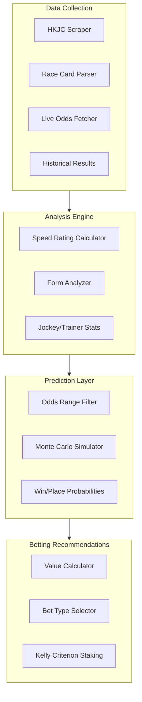
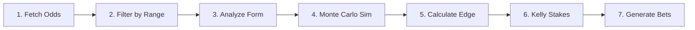
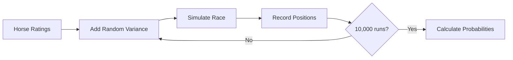
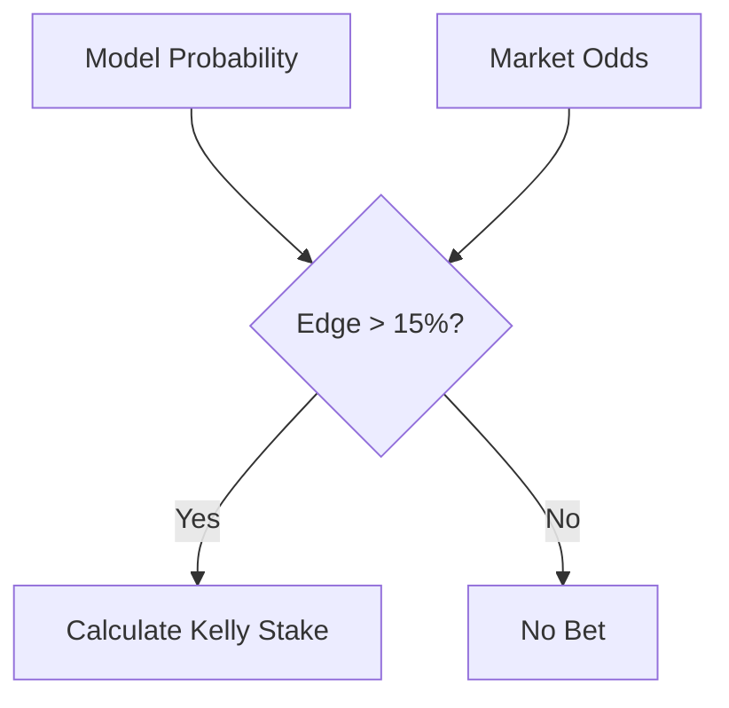

# HK Horse Racing AI

AI-assisted Hong Kong horse racing analysis and betting recommendation system.

## Overview

This project provides tools to:
- **Scrape** race data from HKJC (Hong Kong Jockey Club)
- **Fetch live odds** for upcoming races
- **Analyze** horse performance using speed ratings, form analysis, and jockey/trainer statistics
- **Simulate** race outcomes using Monte Carlo methods
- **Recommend** value bets with Kelly Criterion staking

## Architecture



## Quick Start

```bash
# Install dependencies
npm install

# Install Playwright browser
npx playwright install chromium

# Fetch current odds for a race meeting
npx tsx tools/fetch-odds.ts --date=2026-02-01 --venue=ST

# Analyze a specific race
npx tsx tools/analyze-race.ts --date=2026-02-01 --venue=ST --race=8
```

## CLI Tools

### Fetch Current Odds

Fetch live win/place odds from HKJC betting site.

```bash
# Fetch all races for a meeting
npx tsx tools/fetch-odds.ts --date=2026-02-01 --venue=ST

# Fetch specific race only
npx tsx tools/fetch-odds.ts --date=2026-02-01 --venue=ST --race=8

# Output as JSON
npx tsx tools/fetch-odds.ts --date=2026-02-01 --venue=ST --json

# Save to file
npx tsx tools/fetch-odds.ts --date=2026-02-01 --venue=ST --save
```

**Output:**
```
RACE 8
────────────────────────────────────────────────────────────────────
 # | Horse                    | Jockey          | WIN   | PLACE | Status
────────────────────────────────────────────────────────────────────
 1 | SAGACIOUS LIFE           | Z Purton        |   3.6 |   2.3 | ✓ WIN
 3 | INVINCIBLE IBIS          | H Bowman        |   2.9 |   1.5 | ✓ WIN
 4 | BEAUTY BOLT              | J McDonald      |   8.3 |   2.3 | -

SELECTIONS IN WIN RANGE (2.0-7.0):
  R8 #1 SAGACIOUS LIFE @ 3.6
  R8 #3 INVINCIBLE IBIS @ 2.9
```

### Fetch Jockey Stats

Fetch current season jockey statistics from HKJC.

```bash
# Fetch all tracked jockeys
npx tsx tools/fetch-jockey-stats.ts

# Top 10 only
npx tsx tools/fetch-jockey-stats.ts --top=10

# JSON output
npx tsx tools/fetch-jockey-stats.ts --json
```

**Output:**
```
ELITE TIER (Win % > 15%):
  ⭐ PZ Z Purton - 22.19%
  ⭐ MCJ J McDonald - 16.67%

STRONG TIER (Win % 10-15%):
  ✓ BH H Bowman - 12.11%
```

### Analyze Race

Run full analysis with Monte Carlo simulation.

```bash
npx tsx tools/analyze-race.ts --date=2026-02-01 --venue=ST --race=8
```

### Scrape Single Race Result

Scrape historical race results.

```bash
npx tsx tools/scrape-single-race.ts --date=2026-01-19 --venue=ST --race=1
```

### Scrape Full Meeting

Scrape all races from a meeting.

```bash
npx tsx tools/scrape-meeting.ts --date=2026-01-19 --venue=ST
```

## Project Structure

```
hourse-racing/
├── src/
│   ├── scrapers/           # HKJC data scrapers
│   ├── analysis/           # Statistical analysis modules
│   ├── simulation/         # Race simulation engine
│   ├── betting/            # Bet recommendation logic
│   ├── types/              # TypeScript interfaces
│   └── utils/              # Helper functions
├── tools/
│   ├── fetch-odds.ts       # Live odds fetcher
│   ├── fetch-jockey-stats.ts # Live jockey stats fetcher
│   ├── analyze-race.ts     # Race analysis CLI
│   ├── scrape-single-race.ts
│   └── scrape-meeting.ts
├── data/
│   ├── historical/         # Past race results
│   ├── jockeys/            # Jockey stats (JOCKEY_STATS.md)
│   └── odds/               # Saved odds snapshots
├── prompts/                # AI prompts for analysis
├── rules/                  # Cursor rules
└── skills/                 # Cursor skills
    ├── bet-recommendation/ # Betting workflow
    └── analyze-race/       # Analysis workflow
```

## HKJC Data Sources

### Race Card
```
https://racing.hkjc.com/en-us/local/information/racecard?RaceDate={date}&Racecourse={venue}&RaceNo={race}
```
- **Date format**: `YYYY/MM/DD`
- **Venue**: `ST` (Sha Tin) or `HV` (Happy Valley)
- **Returns**: Entries, draws, weights, jockeys, trainers, last 6 runs

### Current Odds (Live)
```
https://bet.hkjc.com/en/racing/wp/{date}/{venue}/{race}
```
- **Date format**: `YYYY-MM-DD`
- **Returns**: Live win/place odds
- **Note**: Requires JavaScript rendering (use `fetch-odds.ts` tool)

### Horse Profile
```
https://racing.hkjc.com/en-us/local/information/horse?HorseId={horseCode}
```
- **Parameter**: Full horse code (e.g., `HK_2024_K129`)
- **Returns**: Stats, past performances, going record, distance wins

### Jockey Statistics
```
https://racing.hkjc.com/en-us/local/information/jockeywinstat?JockeyId={jockeyCode}
```
- **Parameter**: Jockey code (e.g., `PZ` for Z Purton)
- **Returns**: Season stats, win %, venue/distance breakdown

### Race Results (Historical)
```
https://racing.hkjc.com/en-us/local/information/localresults?RaceDate={date}
```
- **Returns**: Finish order, dividends, times

## Betting Strategy

Based on backtesting (13 meetings, 125 races, **+338% ROI**):

### Odds Range Filter
| Bet Type | Odds Range | Strike Rate | ROI |
|----------|------------|-------------|-----|
| WIN | 2.0 - 7.0 | 56% | +202% |
| PLACE | 5.0 - 15.0 | 73% | +146% |
| QUINELLA | Top 2 in range | 47% | +1,424% |

### Edge Detection
```
Edge = Model Probability - Market Probability

Required: Edge > 15% to place bet
```

### Kelly Staking Constraints
```
Max per bet: 5% of bankroll
Max per race: 10% of bankroll
Max per meeting: 40% of bankroll
```

### Elite Jockey Priority

**Always fetch current stats before betting:**

```bash
npx tsx tools/fetch-jockey-stats.ts
```

| Win % Range | Rating Boost | Action |
|-------------|--------------|--------|
| > 20% | +10 | ⭐⭐⭐ BACK when in WIN range |
| 15-20% | +7 | ⭐⭐ BACK when in WIN range |
| 10-15% | +4 | ⭐ Support if form good |
| < 10% | 0 | No jockey boost |

## Jockey Codes Reference

Fetch current stats: `npx tsx tools/fetch-jockey-stats.ts`

| Jockey | Code | Stats URL |
|--------|------|-----------|
| Z Purton | `PZ` | [Link](https://racing.hkjc.com/en-us/local/information/jockeywinstat?JockeyId=PZ) |
| J Moreira | `MOJ` | [Link](https://racing.hkjc.com/en-us/local/information/jockeywinstat?JockeyId=MOJ) |
| J McDonald | `MCJ` | [Link](https://racing.hkjc.com/en-us/local/information/jockeywinstat?JockeyId=MCJ) |
| H Bowman | `BH` | [Link](https://racing.hkjc.com/en-us/local/information/jockeywinstat?JockeyId=BH) |
| M Guyon | `GM` | [Link](https://racing.hkjc.com/en-us/local/information/jockeywinstat?JockeyId=GM) |
| K Teetan | `TEK` | [Link](https://racing.hkjc.com/en-us/local/information/jockeywinstat?JockeyId=TEK) |
| A Badel | `BA` | [Link](https://racing.hkjc.com/en-us/local/information/jockeywinstat?JockeyId=BA) |

## Horse Code Format

Pattern: `HK_{year}_{brandCode}`

| Example | Description |
|---------|-------------|
| `HK_2024_K129` | Imported 2024, brand K129 |
| `HK_2023_J157` | Imported 2023, brand J157 |

## Betting Workflow



### Complete 7-Step Process

1. **Fetch current odds** using `fetch-odds.ts`
2. **Filter horses** by odds range (WIN: 2.0-7.0, PLACE: 5.0-15.0)
3. **Analyze form** - speed ratings, recent form, class trajectory
4. **Run Monte Carlo simulation** - 10,000 iterations for win/place probabilities
5. **Calculate edge** - Model probability vs market odds (require >15%)
6. **Apply Kelly staking** - Optimal bet sizing with bankroll constraints
7. **Generate betting slip** with stakes and reasoning

See `skills/bet-recommendation/SKILL.md` for detailed workflow.

## Simulation Process



## Value Detection



## Environment Variables

```bash
# Set Playwright browser path if needed
export PLAYWRIGHT_BROWSERS_PATH=/Users/you/Library/Caches/ms-playwright
```

## Troubleshooting

### Playwright Browser Not Found
```bash
npx playwright install chromium
```

### Playwright on Ubuntu / Linux (`libgbm.so.1` missing)

Chromium needs system libraries. If logs show `libgbm.so.1: cannot open shared object file`, install OS deps on the server (Debian/Ubuntu):

```bash
# From repo root, or cd apps/strapi first
pnpm --filter @horse-racing/strapi exec playwright install-deps chromium
```

If `apt` is broken (e.g. EOL Ubuntu), fix sources first, or install packages manually:

```bash
sudo apt-get update
sudo apt-get install -y libgbm1
```

For a fuller set matching Playwright’s usual needs, from `apps/strapi` run `pnpm run playwright:install-linux-deps` (runs `scripts/install-playwright-linux-deps-apt.sh`).

### Odds Fetch Timeout
- Check internet connection
- Verify date is a race day
- Try again (HKJC servers can be slow)

### No Races Found
- Check [HKJC Fixtures](https://racing.hkjc.com/en-us/local/information/fixture) for upcoming dates
- Race cards only available for future races

## Disclaimer

This project is for educational and research purposes only. Gambling involves risk. Never bet more than you can afford to lose.
