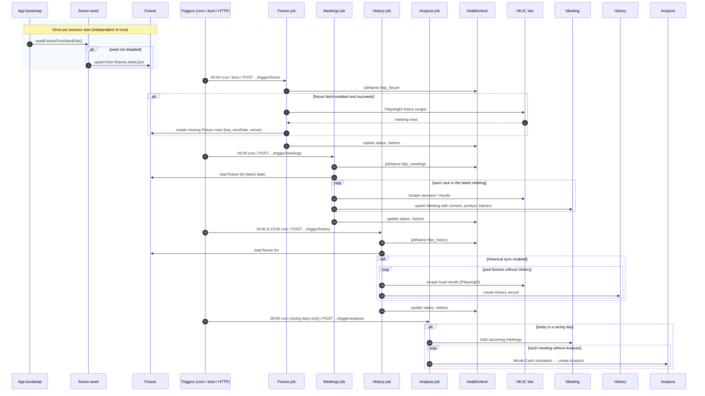

# 🚀 Getting started with Strapi

Strapi comes with a full featured [Command Line Interface](https://docs.strapi.io/dev-docs/cli) (CLI) which lets you scaffold and manage your project in seconds.

### `develop`

Start your Strapi application with autoReload enabled. [Learn more](https://docs.strapi.io/dev-docs/cli#strapi-develop)

```
npm run develop
# or
yarn develop
```

### `start`

Start your Strapi application with autoReload disabled. [Learn more](https://docs.strapi.io/dev-docs/cli#strapi-start)

```
npm run start
# or
yarn start
```

### `build`

Build your admin panel. [Learn more](https://docs.strapi.io/dev-docs/cli#strapi-build)

```
npm run build
# or
yarn build
```

## ⚙️ Deployment

Strapi gives you many possible deployment options for your project including [Strapi Cloud](https://cloud.strapi.io). Browse the [deployment section of the documentation](https://docs.strapi.io/dev-docs/deployment) to find the best solution for your use case.

```
yarn strapi deploy
```

## 📚 Learn more

- [Resource center](https://strapi.io/resource-center) - Strapi resource center.
- [Strapi documentation](https://docs.strapi.io) - Official Strapi documentation.
- [Strapi tutorials](https://strapi.io/tutorials) - List of tutorials made by the core team and the community.
- [Strapi blog](https://strapi.io/blog) - Official Strapi blog containing articles made by the Strapi team and the community.
- [Changelog](https://strapi.io/changelog) - Find out about the Strapi product updates, new features and general improvements.

Feel free to check out the [Strapi GitHub repository](https://github.com/strapi/strapi). Your feedback and contributions are welcome!

## HKJC Sync

All sync jobs are protected by `HKJC_SYNC_TRIGGER_SECRET` (min 8 chars). Pass the secret via the `x-hkjc-sync-secret` header or the `secret` query parameter.

Each job type has its own lock — a second trigger for the same job while it is already running returns **409**. Other job types can still run concurrently.

### Cron schedule

Crons are disabled when `HKJC_CRON_ENABLED=false`. Time zone: `HKJC_CRON_TZ` (default `Asia/Hong_Kong`).

| Job | Default schedule | Env override | What it does |
|-----|-----------------|--------------|--------------|
| **Fixture** | `0 0 * * *` (midnight daily) | `HKJC_CRON_FIXTURE_SCHEDULE` | Scrapes the HKJC fixture calendar and creates missing Fixture rows. |
| **Meetings** | `0 6 * * *` (6 am daily) | `HKJC_CRON_MEETINGS_SCHEDULE` | Fetches all races for the latest meeting date in the Fixture list (racecard + jockey/trainer/horse profile + past performances). |
| **History** | `0 19 * * *,0 23 * * *` (7 pm & 11 pm daily) | `HKJC_CRON_HISTORY_SCHEDULE` | Scrapes HKJC local results for past fixture dates that have no History record yet. Comma-separated for multiple schedules. |
| **Analysis** | `0 8 * * *` (8 am daily) | `HKJC_CRON_ANALYSIS_SCHEDULE` | Runs Monte Carlo simulation for all races — **only** when today is a racing day (a Fixture exists for today). |

### HTTP trigger endpoints

All endpoints are `POST /api/hkjc-sync/trigger/...`.

| Endpoint | Parameters | Description |
|----------|-----------|-------------|
| `/trigger/all` | — | Runs **all four** jobs sequentially: fixture → meetings → history → analysis. |
| `/trigger/fixture` | — | Fetches HKJC fixture calendar and creates missing Fixture rows. |
| `/trigger/meetings` | `date` (yyyy-MM-dd), `venue` (ST\|HV), `raceNo` (1, 1-5, 1,3,7) | Scrapes racecard / results and upserts Meeting rows. Without params, processes the latest fixture date. |
| `/trigger/history` | — | Scrapes HKJC local results for past fixtures without History records. |
| `/trigger/analysis` | `date` (yyyy-MM-dd), `venue` (ST\|HV), `raceNo` (single number) | Runs Monte Carlo analysis. All three params required for a specific race; omit all to analyse every upcoming race. |
| `/trigger` | — | Legacy path — same as `/trigger/all`. |

### Sequence diagram



On **fatal errors** inside the job, **Healthcheck** is updated to `failure` with whatever **metrics** (phase list) were collected so far.

## ✨ Community

- [Discord](https://discord.strapi.io) - Come chat with the Strapi community including the core team.
- [Forum](https://forum.strapi.io/) - Place to discuss, ask questions and find answers, show your Strapi project and get feedback or just talk with other Community members.
- [Awesome Strapi](https://github.com/strapi/awesome-strapi) - A curated list of awesome things related to Strapi.

---

<sub>🤫 Psst! [Strapi is hiring](https://strapi.io/careers).</sub>
